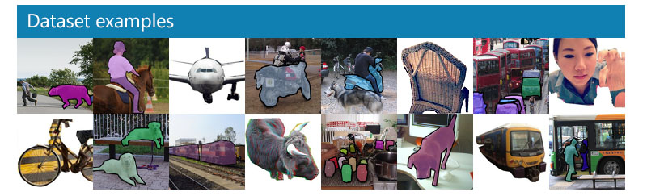

# Image Captioning 🖼️➡️📝

**Automatically describe what you see in an image**

---

## 🚀 Project Overview
This repository showcases a PyTorch-based **Image Captioning** system. Leveraging a pretrained ResNet-18 as an image encoder and an LSTM-based decoder, the model learns to translate image features into natural language descriptions. Perfect for accessibility applications, photo organization, or just for fun!

## 🔑 Key Features
- **CNN Encoder**: Uses pretrained ResNet-18 to extract rich visual features.
- **RNN Decoder**: An LSTM network that learns to generate human-readable captions.
- **End-to-End Training**: Trains on the MS COCO dataset for realistic, diverse descriptions.
- **Inference Pipeline**: Includes preprocessing, sampling, and `clean_sentence` to produce clean captions.
- **Modular Design**: Easily swap encoder backbones or adjust decoder depth.

## 📁 Repository Structure
```
├── 0_Dataset.ipynb        # Prepare and explore MS COCO data
├── 1_Preliminaries.ipynb  # Setup transforms, data loader, and imports
├── 2_Training.ipynb       # Train your Encoder-Decoder model
├── 3_Inference.ipynb      # Generate captions for novel images
├── data_loader.py         # COCO dataset wrapper and DataLoader
├── vocabulary.py          # Build and manage the word vocabulary
├── model.py               # EncoderCNN and DecoderRNN implementations
├── models/                # Saved checkpoint files
├── images/                # Example input/output visuals
└── README.md              # Project overview and instructions
```

## ⚙️ Getting Started
1. **Enable GPU**: In the Udacity workspace, toggle GPU mode for faster training.
2. **Install dependencies**:
   ```bash
   pip install -r requirements.txt
   ```
3. **Download COCO data** (handled automatically if using workspace).
4. **Train**:
   - Run **2_Training.ipynb**, customize hyperparameters (batch size, learning rate, etc.).
   - Monitor loss and perplexity.
5. **Infer**:
   - Run **3_Inference.ipynb** to generate captions on new images.

## 📊 Results
Below is an example of model outputs on COCO test images:

| Image                                      | Generated Caption                         |
|--------------------------------------------|-------------------------------------------|
|        | `A group of people sitting around a table` |

## 🛠️ Customization
- **Change Encoder**: Try deeper ResNets or EfficientNets—just swap in a different model in `model.py`.
- **Adjust Decoder**: Increase `embed_size` or `hidden_size` for richer language models.
- **Data Augmentation**: Modify `transform_train` to include color jitter, rotation, or random crop scales.

## 📚 References
- Vinyals et al., *“Show and Tell: A Neural Image Caption Generator”* (ICLR 2015)
- Xu et al., *“Show, Attend and Tell: Neural Image Caption Generation with Visual Attention”* (ICML 2015)

## 🙏 Acknowledgments
- MS COCO Team for providing the dataset.
- Udacity for the project framework and guidance.

---

